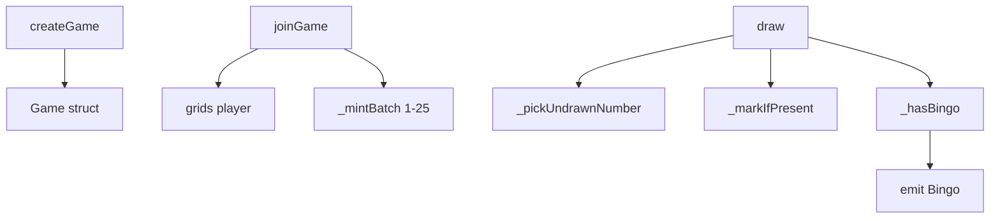

# Issue #10 Architecture: ERC1155 Bingo

## Why This Diagram Exists

- New ERC1155 Bingo game module
- Describes create/join/draw flow and win detection

## System View

## Data And Control Flow Notes

- **State**: `games`, `grids`, `markedBitmaps`, `hasJoined`; ERC1155 balances (token IDs 1-25)
- **Permissions**: Anyone can create, join, or trigger draw
- **Randomness**: blockhash-based (same pattern as SimpleLottery); suitable for demos only
- **Invariants**: Grid contains 1-25 each once; drawn numbers never repeat; first 5-in-row wins

## Review Hotspots

- `_pickUndrawnNumber`: ensures correct selection when many numbers drawn
- `_hasBingo`: 5 rows, 5 cols, 2 diagonals
- `joinGame`: ERC1155 batch mint may trigger receiver callback (reentrancy; no value at risk)
