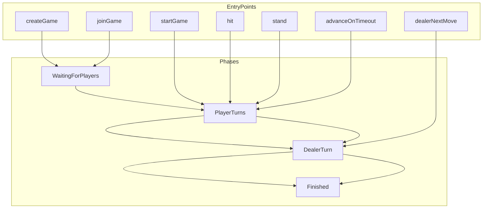

# Issue #11: On-chain Blackjack Architecture

## Why This Diagram Exists

- New game module with phases, player turns, dealer turn, and timeout handling.
- Helps reviewer understand state flow and entry points before reading code.

## System View

## Data And Control Flow Notes

- **State**: `games[gameId]` holds phase, dealerHand, players, playerHands, hasStood, hasBusted, currentPlayerIndex, blockAtTurnStart, drawNonce.
- **Permission**: hit/stand require msg.sender == current player; dealerNextMove and advanceOnTimeout callable by anyone.
- **External calls**: None.
- **Invariants**: Phase transitions are linear; dealer hits until ≥17 or bust; player must act within 10 blocks or advanceOnTimeout.

## Review Hotspots

- `_drawCard`: RNG probabilities (2-9: 1/13, 10: 4/13, Ace: 1/13)
- `_advancePlayerTurn`: Skip stood/busted players, transition to DealerTurn
- `dealerNextMove`: Dealer stand at 17, bust handling
