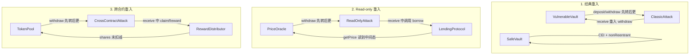

# Issue #13 Architecture

## Changed Entry Points

- `src/19-reentrancy/` — 新增模块，无修改既有入口

## Affected State / Permission Checks

- 无既有状态或权限变更
- 新模块为独立教学示例

## External Effects / Invariants

- 三组合约均为自包含示例，不依赖其他业务模块
- 攻击合约用于演示漏洞，修复版用于对比

## Diagram

## Reviewer Notes

- 每组示例包含：受害合约、攻击合约、修复版（Classic 有 SafeVault；ReadOnly 有 SafePriceOracle；Cross 有 SafeTokenPool）
- 测试覆盖：攻击成功、修复有效
