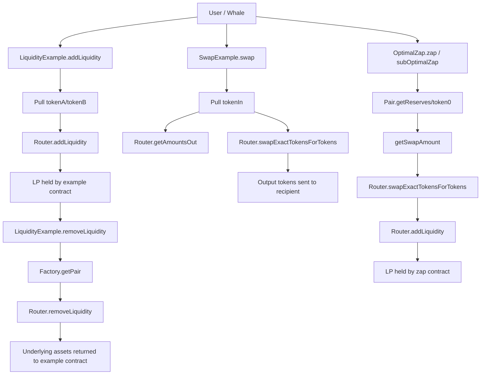

# Issue #14 Architecture

## Why This Diagram Exists

- Issue #14 在原始 `add/remove liquidity` 之外，又通过 comment 扩展为 `swap` 与 `optimal zap` 示例
- 评审者需要先确认三类入口如何共享 Uniswap V2 `Router` / `Factory` / `Pair`，以及哪些资产留存在示例合约内

## System View

## Data And Control Flow Notes

- Changed entry points:
- `addLiquidity()` / `removeLiquidity()` in `src/20-uniswap-v2/UniswapV2LiquidityExample.sol`
- `swap()` / `getAmountOutMin()` in `src/20-uniswap-v2/UniswapV2SwapExample.sol`
- `zap()` / `subOptimalZap()` / `getSwapAmount()` in `src/20-uniswap-v2/UniswapV2OptimalZap.sol`
- Affected state / permission checks:
- no custom roles or ownership checks are introduced
- liquidity and zap examples intentionally custody LP tokens or redeemed assets on the example contract for observability
- `removeLiquidity()` reverts on missing pair or zero LP balance
- `zap()` reverts when the pair does not include `WETH`
- External effects / invariants:
- every example pulls user ERC20 balances via `transferFrom`
- every example approves the canonical Uniswap V2 router before external router calls
- swap routes use a direct path when one side is `WETH`, otherwise use `tokenIn -> WETH -> tokenOut`
- fork tests must interact with deployed mainnet contracts or skip cleanly when no fork is present

## Review Hotspots

- `UniswapV2SwapExample._buildPath()` for direct-vs-WETH-routed swaps
- `UniswapV2OptimalZap.getSwapAmount()` and reserve selection via `token0()`
- `UniswapV2LiquidityExample.removeLiquidity()` guard rails and custody model
- `test/20-uniswap-v2/*.t.sol` proving liquidity, swap, and zap behavior against live fork state
