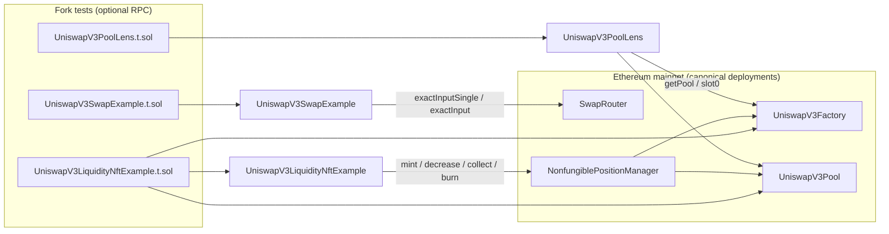

# Issue #15 — Architecture digest (Uniswap V3 teaching module)

## Mermaid (data flow)

## Changed entry points

- `UniswapV3PoolLens`: discover pool (either token order) and read `slot0` + liquidity.
- `UniswapV3SwapExample.swapExactInputSingle` / `swapExactInput` / `encodePath`: single- and multi-hop exact-in swaps via `SwapRouter`.
- `UniswapV3LiquidityNftExample`: `mintPosition`, `decreaseLiquidityAmount`, `collectFees`, `burnPositionFully`; tick helpers `feeToTickSpacing` / `floorTickToSpacing`.

## State / permission notes

- All demos pull ERC20 from `msg.sender` (allowances required). NFT recipient is `msg.sender` on mint.
- `decreaseLiquidity` / `collect` / `burn` are invoked **by this contract** on NPM, so the position owner must grant NPM ERC721 approval to `UniswapV3LiquidityNftExample` (`setApprovalForAll` or `approve`).
- No admin roles; contracts are thin wrappers over canonical periphery/core.

## External effects / invariants worth reviewing

- Swaps and mints depend on **live pool fee tier** and **tick spacing**; wrong fee or misaligned ticks revert at the periphery layer.
- `slot0` and off-chain quotes are **observational**; production paths should enforce `amountOutMinimum` / mint mins against a fresh quote.
- **NPM mainnet address** used in tests: `0xC36442b4a4522E871399CD717aBDD847Ab11FE88` (verify on [deployments](https://docs.uniswap.org/contracts/v3/reference/deployments/ethereum-deployments)).
