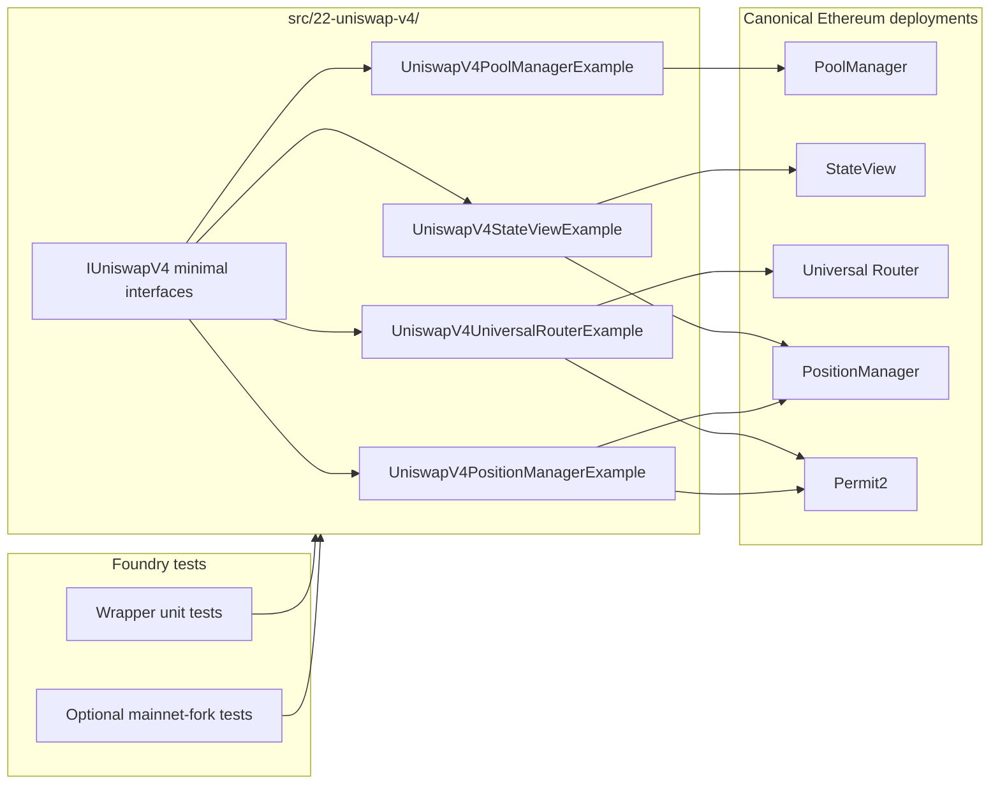

# Issue #16 — Architecture digest (Uniswap V4 MEV/searcher teaching module)

## Mermaid (data flow)

## Changed entry points

- `UniswapV4StateViewExample`: derive `poolId`, read `slot0`, pool liquidity, fee growth, and PositionManager NFT metadata.
- `UniswapV4PoolManagerExample`: demonstrate direct singleton `initialize`, `modifyLiquidity`, `swap`, and `donate` flows through `unlockCallback`.
- `UniswapV4UniversalRouterExample`: build a V4 exact-input Universal Router payload and route Permit2 approvals through the wrapper.
- `UniswapV4PositionManagerExample`: encode and execute PositionManager mint / increase / decrease / burn action batches.

## State / permission notes

- Router and PositionManager wrappers are intentionally custodial for the duration of each call: they pull ERC20s into the wrapper, forward Permit2 approvals, execute the canonical contract, then refund leftover balances.
- Direct `PoolManager` flows settle negative deltas by pulling ERC20 from the caller and taking positive deltas to the requested recipient.
- No admin roles are introduced; correctness depends on the caller providing the right `PoolKey`, tick range, and slippage bounds.

## External effects / invariants worth reviewing

- `PoolManager.unlock()` is the central trust boundary for raw V4 core usage; tests and docs should make the callback-settlement pattern obvious.
- Searcher-style reads rely on `StateView` / PositionManager snapshots, which are safe for observation but not authoritative price guarantees.
- The module intentionally uses minimal local ABIs instead of importing the full V4 repos, preserving the existing repo compiler while still targeting canonical mainnet addresses.
