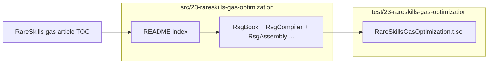

# Issue #17 — architecture digest

## Diagram

## Changed entry points

- New teaching contracts under `src/23-rareskills-gas-optimization/`; no changes to existing production-style modules.
- New Foundry tests under `test/23-rareskills-gas-optimization/` that call paired “naive vs optimized” contracts and log or assert gas deltas.

## State / permission checks

- No shared global state; each demo contract owns its storage.
- `RsgDesign01MultiDelegate` is a **teaching sketch** only: delegatecall batches are unsafe with untrusted `targets`/`data` and must never be copied into production without hardening.

## External effects / invariants

- Gas tests use `staticcall` for `view`/`pure` demos and `call` / `call{value}` for mutating flows.
- Article bullets that are wallet-level, pipeline-only, or unsafe are captured as **README doc-only rows** plus `RsgDanger` / `RsgMeta` documentation instead of executable benchmarks.

## Reviewer notes

- Follow `README.md` for the authoritative article bullet → symbol map.
- When a test **logs without asserting**, the article explicitly warns that the “obvious” optimization can invert on a given compiler version.
