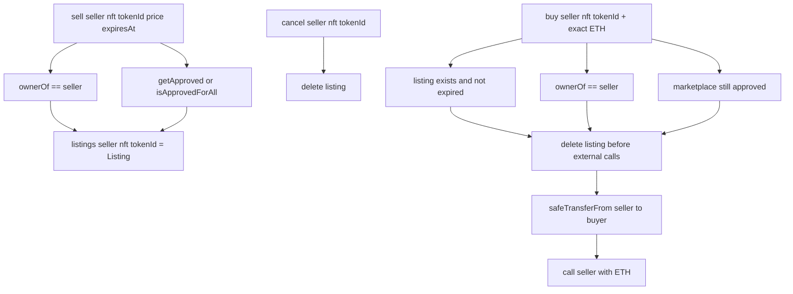

# Issue Architecture Digest

## Why This Diagram Exists

- `#7` 新增了一个非托管式 `ERC721` marketplace：卖家通过授权挂单，买家支付 `ETH` 后由合约代扣 NFT 并结算款项。
- 这个改动的核心审查点不是复杂算法，而是挂单状态、权限校验、外部调用顺序，以及重复挂单覆盖后旧状态如何失效。

## System View

## Data And Control Flow Notes

- 变更的核心状态只有 `listings[seller][nft][tokenId]`，每个 `seller + nft + tokenId` 只保留一条活跃挂单。
- 重复 `sell()` 直接覆盖当前挂单，因此旧价格和旧过期时间不会再被 `buy()` 读取。
- `buy()` 在任何外部交互前先删除挂单，避免同一条挂单被重入或重复成交。
- 权限边界依赖 `ownerOf` 与 `getApproved/isApprovedForAll` 的实时链上状态，因此卖家转走 NFT 或撤销授权后，旧挂单会变成不可成交但仍可取消。
- 外部效果只有两个：`ERC721.safeTransferFrom` 和向卖家 `call` 转 `ETH`；卖家如果不能收款，则整笔购买回滚。

## Review Hotspots

- 先看 `src/13-simple-nft-marketplace/SimpleNFTMarketplace.sol` 的 `sell()`、`buy()`、`_requireOwnedAndApproved()`。
- 再看“覆盖旧挂单”和“卖家状态漂移”的测试，确认旧挂单不会被旧价格成交，且撤销授权/转走 NFT 时会安全失败。
- 最后看 `test/13-simple-nft-marketplace/SimpleNFTMarketplace.t.sol` 里的 `test_SecondSellOverwritesExistingListing`、`test_Revert_BuyWhenSellerTransferredNftAway`、`test_Revert_BuyWhenSellerCannotReceiveEther`。
