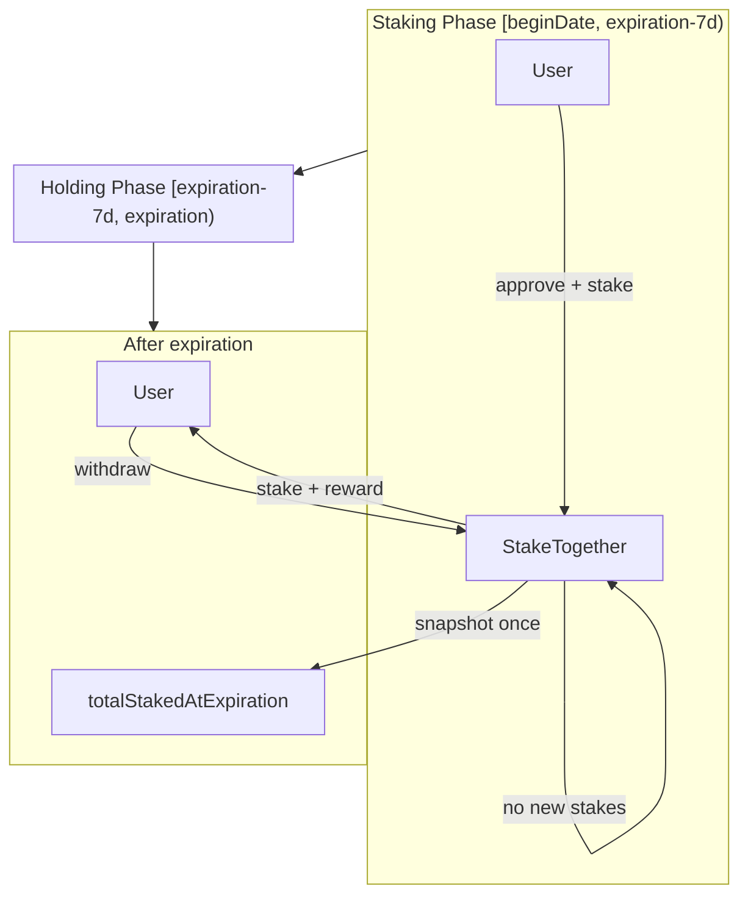

# Issue Architecture Digest

## Why This Diagram Exists

- New StakeTogether staking contract with proportional reward distribution.
- Reviewer should understand the stake window, snapshot timing, and security boundaries before reading the code.

## System View

## Data And Control Flow Notes

- **State**: `stakeOf[user]`, `totalStaked`, `_totalStakedAtExpiration` (snapshot), `_snapshotTaken`.
- **Permission**: Anyone can stake during window; anyone with stake can withdraw after expiration.
- **External calls**: `token.safeTransferFrom` (stake), `token.safeTransfer` (withdraw). ReentrancyGuard on withdraw.
- **Invariants**: Staking only allowed when `block.timestamp < expiration - 7 days`; snapshot taken on first withdraw; reward = REWARD_POOL * userStake / totalStakedAtExpiration.

## Review Hotspots

- `StakeTogether.sol`: `stake()` (window check, reward pool check), `withdraw()` (snapshot, reward calc, CEI).
- `test/14-stake-together/StakeTogether.t.sol`: `test_Attack_LastMinuteStake_Blocked`, `test_Stake_ProportionalReward_ExampleFromIssue`.
