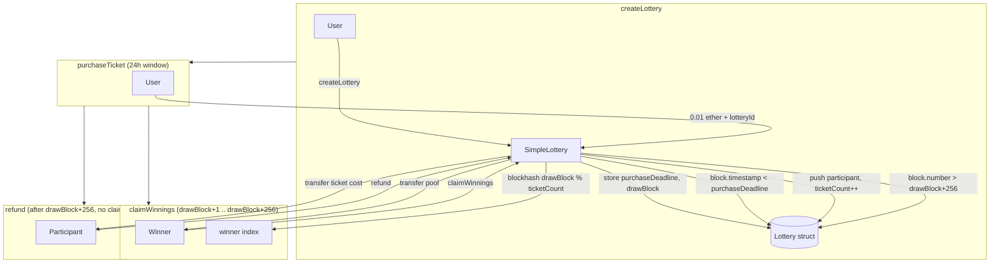

# Issue #9 Architecture Digest

## Why This Diagram Exists

- SimpleLottery adds a new standalone contract with create/purchase/claim/refund flow.
- Reviewer should understand state transitions and blockhash-based randomness before reading code.

## System View

## Data And Control Flow Notes

- **State**: `lotteries[lotteryId]` holds purchaseDeadline, drawBlock, participants[], ticketCount, winner, winnerClaimed.
- **Permission**: Any address can create, purchase, claim (if winner), refund (if past lookback).
- **External**: ETH transfers via `call{value}`; ReentrancyGuard protects claim/refund.
- **Invariants**: blockhash(drawBlock) only available when block.number > drawBlock; claim window = [drawBlock+1, drawBlock+256].

## Review Hotspots

- `claimWinnings`: blockhash lookup, winner selection, transfer.
- `refund`: _removeParticipant swap-with-last logic, ticketCount decrement.
- `test/15-simple-lottery/SimpleLottery.t.sol`: vm.roll for block advancement, blockhash availability.
