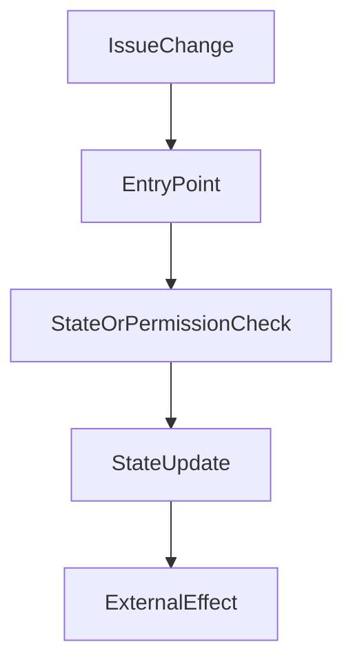

# Issue Architecture Digest Template

Use this file as `docs/issues/<issue-number>/architecture.md` when a change affects behavior, state flow, permissions, module boundaries, or external interactions.

## Why This Diagram Exists

- `<what changed>`
- `<why the reviewer should read this before the code>`

## System View

## Data And Control Flow Notes

- `<state variables or storage regions that changed>`
- `<permission boundaries>`
- `<external calls or integrations>`
- `<important invariants>`

## Review Hotspots

- `<file or function to inspect first>`
- `<edge case or regression risk>`
- `<tests that prove the diagram's claims>`
